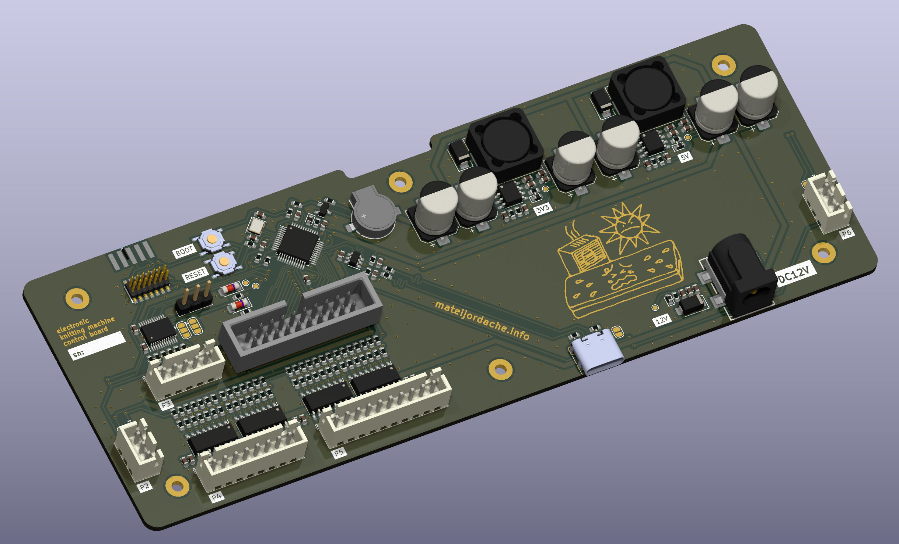

# Electronic Knitting Machine Controller
Inspired by the Knitic project, which seems to have mostly been abandoned. 
This board is to be a replacement for the mainboard within the machine, 
initially targeting Brother KH-930, KH-940 machines. While it disables the 
main touch controls, there is available a serial port which can control 
the patterns. Eventually, it would be nice to also design some 
compatibility with the original user interface panel. Additionally, the 
solenoid controls signals are exposed via HP 1650-63203 20-pin logic 
analyzer connector, either for debugging, or direct control of the 
solenoid array if you wish to just ignore the microcontroller on the 
board.

This board also has a standalone power supply, so you can remove or ignore 
the transformer and power supply PCB built into the machine, which is 
quite heavy. 

Conveniently, the connectors used for the solenoid control as well as 
encoders and carriage signals fit modern JST-XH connectors, so these are 
compatible with the wiring assemblies already inside the machine.
